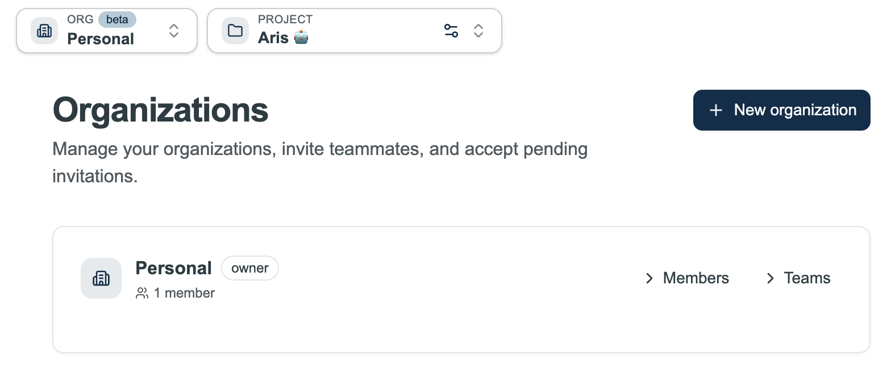

# Collaboration & Sharing

[← Home](Home) · **Collaboration & Sharing**

Protos supports sharing resources with teammates and publishing canvases for external stakeholders.

---

## On This Page

- [Organisations](#organisations)
- [Teams](#teams)
- [Access Roles](#access-roles)
- [Sharing Resources](#sharing-resources)
- [Discovering Shared Resources](#discovering-shared-resources)
- [Canvas Soft-Lock](#canvas-soft-lock)
- [Shared Co-Engineer Chats](#shared-co-engineer-chats)
- [Publishing for External Access](#publishing-for-external-access)

---

## Organisations

An organisation is the top-level workspace in Protos. Projects, models, canvases, and team members all belong to an organisation. You can be a member of more than one organisation and switch between them at any time.

### Creating an organisation

Go to **User menu → Manage organisations → Create organisation**. Enter a name and confirm. You become the owner of the new organisation.

### Inviting members

From the **Organisations** page, open your organisation and click **Invite member**. Enter the invitee's email address. They will receive an invitation to accept or decline.

### Accepting an invitation

Pending invitations appear on the **Organisations** page. Click **Accept** to join or **Decline** to dismiss.

### Switching organisations

The **org switcher** is always visible in the navigation. Click it to see all organisations you belong to and switch between them. Everything in Protos — projects, the Models Library, team members — is scoped to your active organisation.

---

## Teams

Organisations can have a tree of teams to reflect how your group is structured. Teams make it easier to share resources with a group of people at once.

### Managing teams

From the **Organisations** page, open your organisation to see and manage the team tree. You can create sub-teams, add members to teams, and assign a **team manager** role to any member.

---

## Access Roles

When you share a resource, the person you share it with gets one of three roles:

| Role | What they can do |
|------|-----------------|
| **Owner** | Full control — view, edit, run, share, and publish |
| **Editor** | Can co-edit the resource directly — no need to copy it first. Sharing reach is limited to your organisation |
| **Viewer** | Read-only access — can view and run, but cannot edit or share |

---

## Sharing Resources

Sharing works across canvases, schemas, data documents, models, and co-engineer chats — all through the same **Share** dialog.

### How to share

1. Open the resource you want to share (canvas, schema, data document, model, or co-engineer chat).
2. Click the **Share** button.
3. Choose who to share with:
   - **Individual user** — search by name or email
   - **Team** — share with an entire team in your organisation
   - **Organisation** — share with everyone in the active org
4. Select a role (**Editor** or **Viewer**).
5. Click **Share**.

> **Editors** can reshare within the organisation. **Viewers** cannot reshare.

---

## Discovering Shared Resources

All resource lists (canvases, schemas, data documents, models) have scope tabs at the top:

| Tab | Shows |
|-----|-------|
| **Mine** | Resources you own |
| **Shared with me** | Resources others have shared directly with you |
| **Organisation** | All resources visible to your active organisation |
| **All** | Everything you have access to |

---

## Canvas Soft-Lock

When a team member is actively editing a component on a canvas, that component appears **locked** to all other users. This prevents conflicting edits.

A locked component shows a lock indicator with the name of the person currently editing. The lock releases automatically when they stop.

---

## Shared Co-Engineer Chats

Co-engineer sessions can be shared with org members.

1. Open a chat session and click **Share**.
2. Assign **Editor** or **Viewer** access to individuals, teams, or the whole org.
3. Shared sessions appear under **Shared with me** in the chat session list.
4. **Viewers** see a read-only transcript. **Editors** can continue the conversation.

---

## Publishing for External Access

**Publications** let you share a canvas with people who don't have a Protos account — customers, partners, or reviewers.

A publication is a **snapshot of a canvas** at a point in time, accessible via a public URL.

### What external viewers can do

- See the canvas parameters and outputs
- Adjust parameter values and re-run the canvas interactively
- View linked data documents

### What they cannot see

- Your Python calculation code (stripped from the snapshot)
- Other canvases or projects
- The Knowledge Library or any internal data

### How to publish

1. Open **Simulation Studio** from the sidebar. Click **Publish** in the top right of the canvas list.
2. Give the publication a **name**.
3. Select which **canvases to include**.
4. Optionally check **Include data tab** to expose the underlying data to viewers.
5. Optionally set a **password** for access control.
6. Click **Publish** — a shareable URL is generated.

> **Note:** Publications are snapshots — they do not update automatically when you change the canvas. Re-publish to push an update.

---

## See Also

- [Home → Project Overview](Home#project-overview)
- [Glossary → Design freeze](Glossary), [Glossary → Version](Glossary)

---

*[← Back to Home](Home)*
