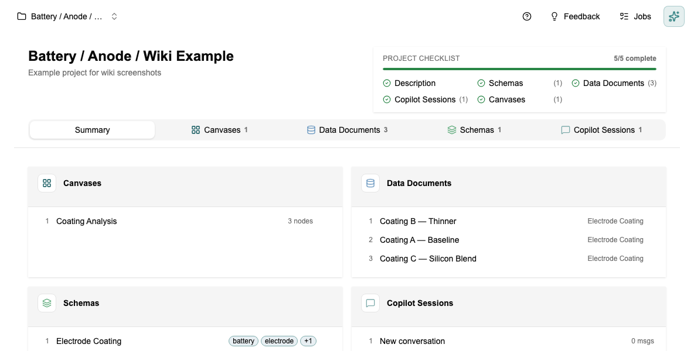
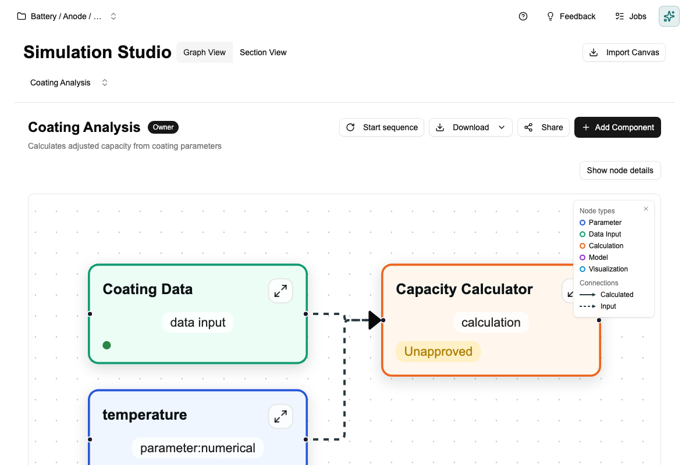

# Tutorial: Working with the Co-engineer

[← Home](Home) · [← Co-engineer](Co-engineer)

> For a full list of capabilities and how it gets smarter over time, see [Co-engineer](Co-engineer).

This tutorial shows you what the Co-engineer actually does when you use it — not just what it can do, but what the interaction looks like. Takes about 10 minutes.

---

## Before you start

The Co-engineer works best when you have:
- At least one document in the **Knowledge Library** — so it has project context to draw on
- At least one **Schema** — so it knows what structure to fill when creating documents

If you haven't done those yet: [Tutorial: Creating Your First Schema](Tutorial-Schemas) → [Tutorial: Setting Up Your Knowledge Library](Tutorial-Knowledge-Library).

---

## Step 1 — Ask it to create a schema

Open the Co-engineer panel (chat icon, right side of the screen) and try:

> *"Create a schema for electrode coating experiments with fields for coating thickness, porosity, active material type, and mass loading."*

It will search for existing schemas first, then propose field names, types, and units. **It asks for your confirmation before creating anything.** Review the proposal — if a type or unit is wrong, say so before confirming.

Once confirmed, check the Schema Editor. Edit anything that doesn't look right before creating documents against it.

---

## Step 2 — Ask it to create a document from a file

Upload a file in the chat (a test report, datasheet, or any document with values), then ask:

> *"Create an Electrode Coating document from this file."*

It reads the file, searches the Knowledge Library for supporting context, maps values to your schema fields, and shows you what it found. If a required field is missing, it tells you rather than guessing. Fill in the gaps manually and confirm.

---

## Step 3 — Check the provenance

Open the document that was just created. Fields populated from the Knowledge Library have a provenance marker showing the exact chunk they came from. Click it to read the original source. This is the traceability the [Knowledge Library](Knowledge-Library#traceability) page describes — here's where you actually see it.

---

## Step 4 — Ask a question

> *"What does the Knowledge Library say about optimal porosity for NMC811 electrodes?"*

The answer will include citations. Click any citation to verify the source. If the library doesn't have relevant information, it will say so rather than making something up.

---

## Step 5 — Ask it to set up the Data Studio

> *"Activate the three most recent electrode coating documents in the Data Studio."*

Go to the Data Studio — the documents should now be active and visible as columns in the table.

---

## Step 6 — Ask it to build a canvas

> *"Build a canvas that takes my electrode coating data as input and calculates the theoretical capacity."*

It creates the canvas in Simulation Studio, adds an Input block, writes the calculation code, and wires everything together. **The calculation block will need your approval before it runs** — read the code, confirm it looks right, then approve it.

---

*[← Back to Home](Home)*
