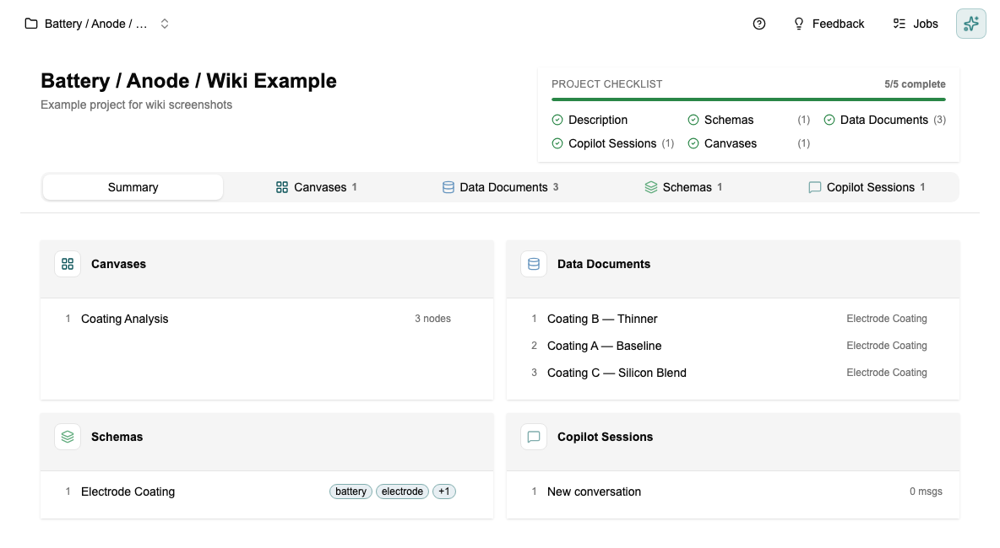

# Tutorial: Working with the Co-engineer

[← Home](Home) · [← Co-engineer](Co-engineer)

> For a full list of capabilities and how it gets smarter over time, see [Co-engineer](Co-engineer).

This tutorial shows you what the Co-engineer does when you use it — what to ask, what happens, and how to verify the results. Takes about 10 minutes.

---

## Before you start

The Co-engineer works best when you have at least one document in the **Knowledge Library** so it has project context to draw on. If you haven't done that yet: [Tutorial: Setting Up Your Knowledge Library](Tutorial-Knowledge-Library).

---

## Step 1 — Ask it to create a schema

Open the Co-engineer panel (chat icon on the right side of the screen) and type:

> *"Create a schema for electrode coating experiments with fields for coating thickness, porosity, active material type, and mass loading."*

It will search for existing schemas first, then propose the schema with field names, types, and units. **It asks for your confirmation before creating anything.** Review the proposal — if a type or unit is wrong, say so before confirming.

---

## Step 2 — Ask it to create data documents from a file

Upload a test report, datasheet, or any file with values in the chat, then ask:

> *"Create an Electrode Coating document from this file."*

It reads the file, maps the values to your schema fields, and shows you what it found. Missing required fields are flagged — you fill in the gaps and confirm.

---

## Step 3 — Ask it a question grounded in your library

> *"What does the Knowledge Library say about optimal porosity for NMC811 electrodes?"*

The answer includes citations. Click any citation to verify the original source. If the library doesn't have relevant information, it says so rather than guessing.

---

## Step 4 — Ask it to set up the Data Studio

> *"Activate the three most recent electrode coating documents in the Data Studio."*

Go to the Data Studio to confirm the documents are now active and visible as columns.

---

## Step 5 — Ask it to build a canvas

> *"Build a canvas that takes my electrode coating data as input and calculates the theoretical capacity."*

It creates the canvas, adds an Input block, writes the calculation code, and wires everything together.

**The calculation block needs your approval before it runs.** Read the code, confirm it looks right, then approve it.

---

## What a project looks like after working with the Co-engineer

After following these steps, your project will have schemas, data documents, a canvas, and knowledge sources all linked together.

---

*[← Back to Home](Home)*
