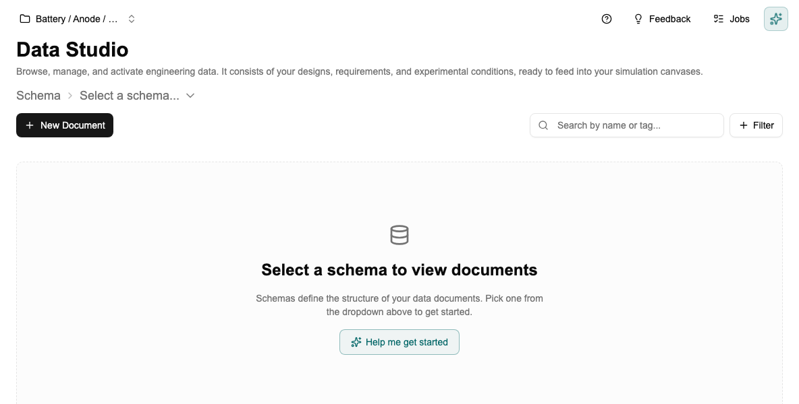
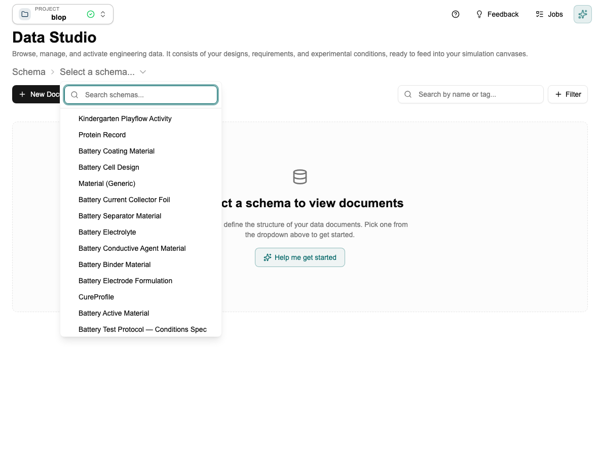
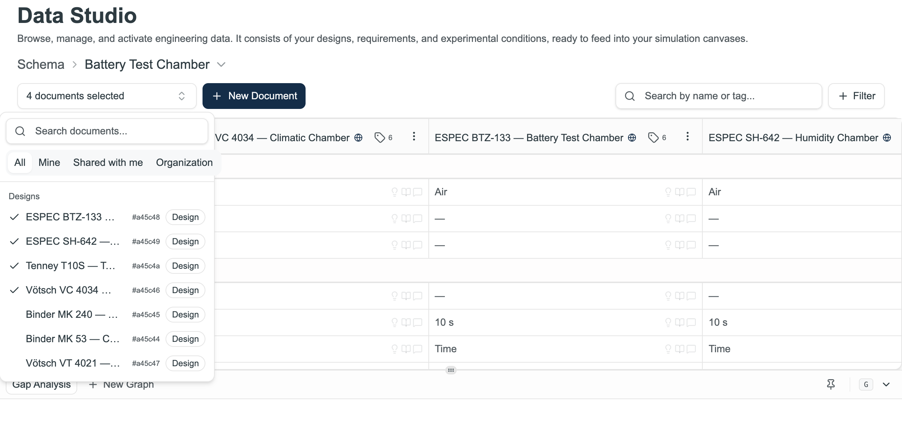

# Tutorial: Using the Data Studio

[← Home](Home) · [← Data Studio](Data-Studio)

> For a full explanation of how the Data Studio connects to the canvas, see [Data Studio](Data-Studio).

This tutorial shows you how to get your data documents loaded and ready for a simulation. Takes about 5 minutes.

> **The Co-engineer can do this for you.** Ask it: *"Activate the three most recent electrode coating documents in the Data Studio."* It will select and activate the right documents without you needing to navigate here manually. Come to the Data Studio directly when you want to compare values visually or edit inline.

---

## Step 1 — Open the Data Studio

Click **Data Studio** in the sidebar. When you first open it, it asks you to pick a schema.

---

## Step 2 — Pick a schema

Click the **Select a schema…** dropdown. All schemas in your project appear.

Click the schema you want to work with — for example **Electrode Coating**.

---

## Step 3 — Activate documents

All data documents following that schema appear in a list on the left. Click the ones you want to compare — each one becomes a **column** in the table, with all fields as rows.

With 3 documents activated you can compare their values side by side at a glance:

---

## Step 4 — Pin a requirement (optional)

If your project has a requirements document (your target spec), you can pin it as a column next to your designs. This makes the gap between your current designs and your target immediately visible.

To pin a requirement, find the requirements document in the left-hand list and click the **pin** icon next to it. It will appear as a fixed column alongside your active documents.

---

## Step 5 — Edit values directly in the table

Double-click any cell to change its value without leaving the Data Studio. Press Enter to save — the change updates the original document immediately.

---

## Step 6 — The canvas picks this up automatically

Whatever documents are activated here are what the canvas runs on. Go to **Simulation Studio** — the canvas will re-run automatically with the new inputs. Swap a document out and it recalculates again.

---

## Next step

→ [Tutorial: Building Your First Canvas](Tutorial-Simulation-Studio) — now that your data is set up, build the calculation that runs on it.

---

*[← Back to Home](Home)*
