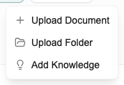

# Tutorial: Setting Up Your Knowledge Library

[← Home](Home) · [← Knowledge Library](Knowledge-Library)

> For full details on adding documents, folder uploads, and traceability, see [Knowledge Library](Knowledge-Library).

This tutorial explains why to set up the Knowledge Library early and what makes it useful. Takes about 5 minutes.

---

## Do this before you start designing

The Co-engineer draws on the Knowledge Library when creating schemas and data documents. If you populate it first, it will cite real sources from your project context. If you skip it, it falls back to general knowledge.

---

## Step 1 — Upload your reference material

Click **Knowledge Library** in the sidebar → **Add**.

Upload the documents that inform your project — papers, test reports, spec documents, datasheets. See [Knowledge Library → Adding to the Library](Knowledge-Library#adding-to-the-library) for the three upload methods (file, text note, folder).

**One thing the reference page doesn't emphasise enough:** capture decisions as text notes *as you make them*, not retrospectively. The rationale is clearest in the moment. A note like *"Chose 1.2 mol/L — Q1 study showed peak conductivity at this concentration under our temperature range"* is far more useful than a note written six months later.

---

## Step 2 — Tag consistently

Pick a tag taxonomy before you start and stick to it. Examples:
- By material: `graphite`, `nmc811`, `lfp`
- By type: `paper`, `decision`, `spec`

Inconsistent tags make search unreliable as the library grows.

---

## Step 3 — Verify it's working

Search for a keyword you know is in a document you just uploaded. If it appears, the library is ready for the Co-engineer to use.

---

## How the traceability works

When the Co-engineer creates a data document using a value from the library, it records exactly which chunk of which document that value came from. You can click through from any field value to the original source. See [Knowledge Library → Traceability](Knowledge-Library#traceability).

---

*[← Back to Home](Home)*
