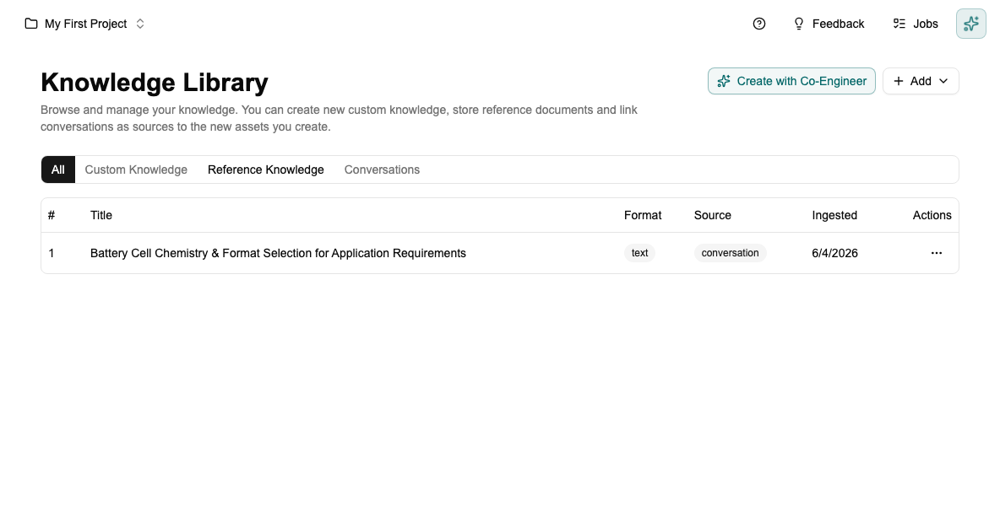
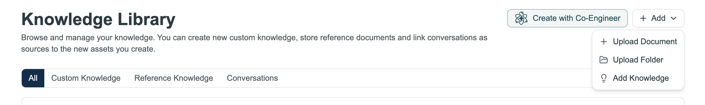

# Tutorial: Setting Up Your Knowledge Library

[← Home](Home) · [← Knowledge Library](Knowledge-Library)

> For full details on adding documents, folder uploads, and traceability, see [Knowledge Library](Knowledge-Library).

This tutorial shows you how to upload your reference material so the Co-engineer can use it. Takes about 5 minutes.

> **Do this first, before anything else.** The Co-engineer draws on the Knowledge Library for every task — creating schemas, filling in data documents, answering questions. The richer the library, the better and more traceable its output. An empty library means generic answers; a populated library means answers grounded in your actual project data.

---

## Step 1 — Open the Knowledge Library

Click **Knowledge Library** in the sidebar.

---

## Step 2 — Add your documents

Click **+ Add**. A dropdown appears with three options:

- **Upload Document** — upload a PDF, TXT, or JSON file (a paper, test report, spec, datasheet). This is the most common option.
- **Upload Folder** — bulk upload many files at once. A progress indicator tracks succeeded and failed files.
- **Add Knowledge** — type a note directly without a file. Use this for decisions and rationale captured in the moment.

Choose **Upload Document**, select your file, give it a name and tags, and click Upload. Protos splits it into chunks and embeds them so the Co-engineer can search across the content.

---

## Step 3 — Or let the Co-engineer create knowledge from a conversation

Notice the **Create with Co-Engineer** button at the top. After a Co-engineer session, it can save key findings, decisions, or summaries directly into the Knowledge Library. Any future session can then draw on what was captured.

---

## Step 4 — Tag consistently

Pick a tag taxonomy with your team before you start — for example by material (`graphite`, `nmc811`) or type (`paper`, `decision`, `spec`). Inconsistent tags make search unreliable later.

---

## Step 5 — Verify it's working

Search for a keyword you know is in a document you just uploaded. If it appears, the library is ready.

**One thing that matters most:** capture decisions as text notes *as you make them*. A note like *"Chose 1.2 mol/L — Q1 study showed peak conductivity at this concentration"* written in the moment is far more useful than trying to reconstruct it six months later.

---

## Next step

→ [Tutorial: Working with the Co-engineer](Tutorial-Co-engineer) — now that the library is populated, use the Co-engineer to build your first schema from it.

---

*[← Back to Home](Home)*
