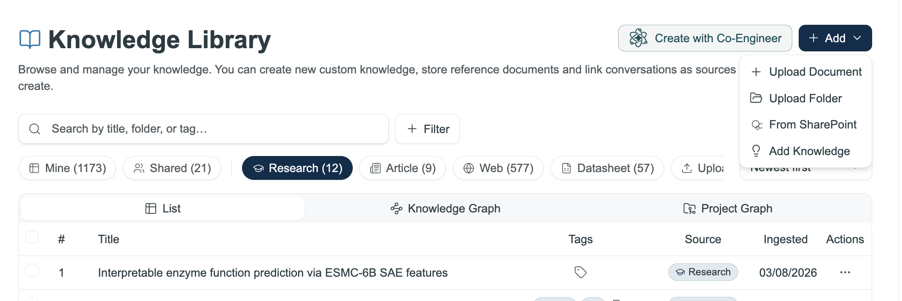
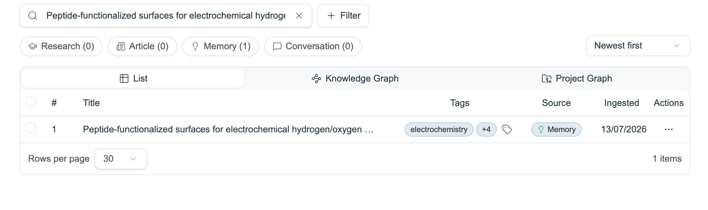
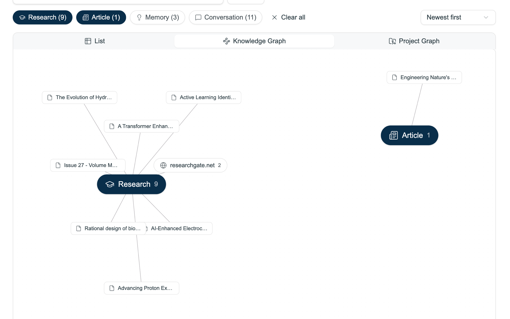
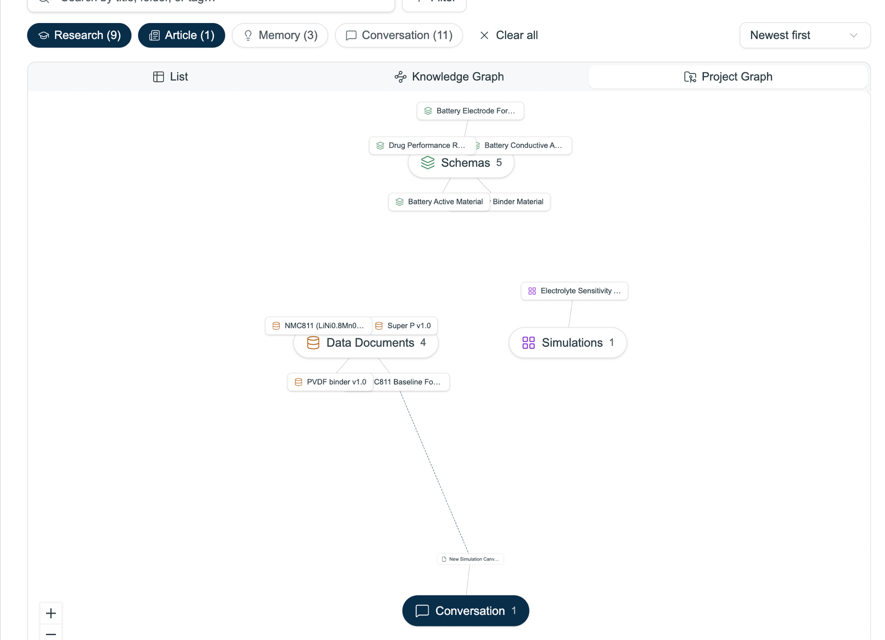
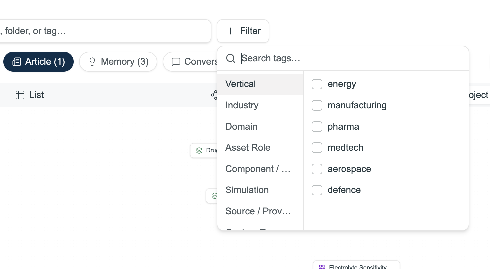
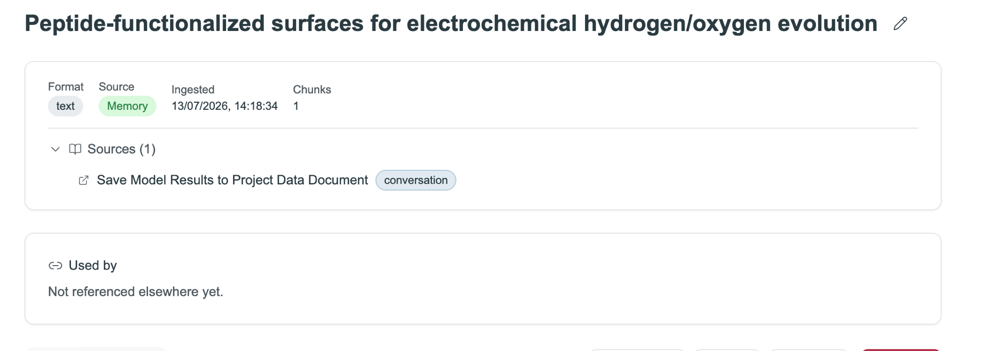

# Tutorial: Setting Up and Navigating Your Knowledge Library

[← Home](Home) · [← Knowledge Library](Knowledge-Library)

> For full details on adding documents, folder uploads, provenance, and sharing, see [Knowledge Library](Knowledge-Library).

This tutorial shows you how to fill your Knowledge Library so the Co-Engineer can use it, and how to find your way around once it's populated. Takes about 7 minutes.

> **Do this first, before anything else.** The Co-Engineer draws on the Knowledge Library for every task — creating schemas, filling in data documents, answering questions. The richer the library, the better and more traceable its output. An empty library means generic answers; a populated library means answers grounded in your actual project data.

---

## Step 1 — Open the Knowledge Library

Click **Knowledge** in the sidebar.

---

## Step 2 — Add your documents

Click **+ Add**. A dropdown appears with four options:

- **Upload Document** — upload a file (PDF, DOCX, XLSX, XLS, CSV, TXT, MD, JSON, PNG, JPG, JPEG, WEBP, GIF, TIFF, and more — up to 32 MB). This is the most common option.
- **Upload Folder** — bulk upload many files at once. A progress indicator tracks succeeded and failed files.
- **From SharePoint** — import files, folders, or a whole document library from SharePoint. See [Import from SharePoint](Knowledge-Library#import-from-sharepoint).
- **Add Knowledge** — type a note directly without a file. Use this for decisions and rationale captured in the moment.

Choose **Upload Document**, select your file, give it a name, and click Upload. Protos splits it into chunks and embeds them so the Co-Engineer can search across the content.

---

## Step 3 — Or let the Co-Engineer create knowledge from a conversation

Notice the **Create with Co-Engineer** button at the top. Click it to open a Co-Engineer session pre-loaded with a prompt to help you add knowledge — describe what you want to capture and the Co-Engineer will guide you through creating entries.

---

## Step 4 — Name, tag, and categorize

Give each document a clear, consistent title (e.g. by material or document type). You can also add **tags** to a document inline from its row in the library table, and Protos auto-classifies each document into a **source category** (Research, Datasheet, Web, …). See [Knowledge Library → Tags](Knowledge-Library#tags) for more.

---

## Step 5 — Find your way around

Once you have a few documents, the library gives you three views, switched from the tabs at the top:

- **List** — the default: a flat, paginated table with one row per document.
- **Knowledge Graph** — a visual map of how your documents and the assets that cite them connect.
- **Project Graph** — the same connections narrowed to the current project.

In the List view, narrow things down with:

- **Category chips** (Research, Article, Memory, Conversation, …) — each shows a count; click to filter by where a document came from.
- **Tag filter** — click **+ Filter** to filter to documents carrying a given tag.
- **Mine / Shared chips** — these appear once documents have been shared with you, so you can switch between your own documents and shared ones.
- **Search** — matches titles, folder names, and tags (not document content). Search for a keyword from a document you just added to confirm it's in the library.

---

## Step 6 — Open a document

Click any row to open its detail page, where you can:

- Read the full content — and edit the text inline for knowledge notes.
- See its **source category** and the **sources** it drew on.
- See what it's **Used by** — the schemas, data documents, models, and canvases built from it. (For a document created from a Co-Engineer conversation, this panel is titled **"Modified in this conversation"** and links back to that chat.)
- **Download** the original file (or the extracted text, for conversation- and note-based entries).
- **Share** it read-only with people, teams, or an email domain.

---

**One thing that matters most:** capture decisions as text notes *as you make them*. A note like *"Chose 1.2 mol/L — Q1 study showed peak conductivity at this concentration"* written in the moment is far more useful than trying to reconstruct it six months later.

---

## Next step

→ [Tutorial: Working with the Co-Engineer](Tutorial-Co-engineer) — now that the library is populated, use the Co-Engineer to build your first schema from it.

---

*[← Back to Home](Home)*
