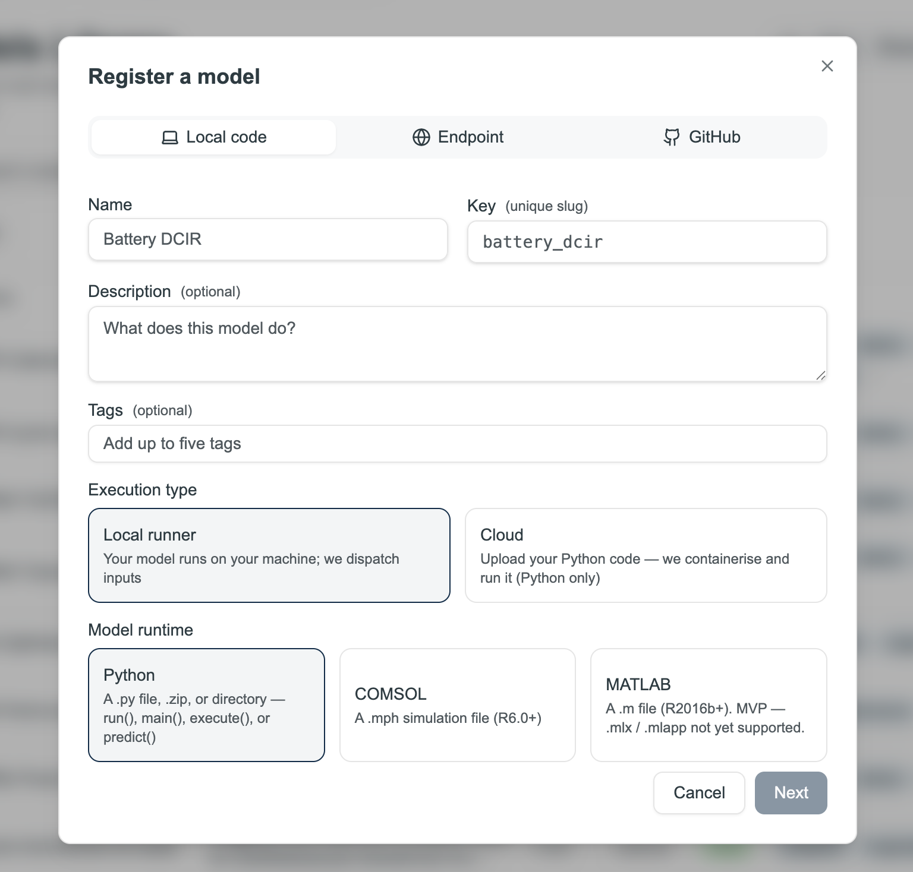

# Tutorial: Registering Your First Model

[← Home](Home) · [← Models Library](Model-Library)

> For source types, versioning rules, and best practices, see [Model Library](Model-Library).

This tutorial walks you through registering a Python script and verifying it works in a canvas. Takes about 10 minutes.

> **The Co-engineer can register models for you.** Upload your script in the Co-engineer chat and say *"Register this as a model."* It will infer the input/output schema automatically and handle the registration. This tutorial is for when you want to do it manually or understand what's happening under the hood.

---

## What you need

A Python script with a function named `run`, `main`, `execute`, `predict`, or `simulate` that takes inputs as arguments and returns a dict. A minimal example:

```python
def run(coating_thickness: float, porosity: float, temperature: float):
    result = coating_thickness * porosity * (1 + 0.002 * temperature)
    return {"adjusted_capacity": result}
```

---

## Step 1 — Register it

Click **Models** in the sidebar, then click **+ Register model** in the top right.


The registration dialog opens. Give your model a name and key, choose **Local runner** or **Cloud** for execution type, and select the runtime (Python, COMSOL, or MATLAB).

{ width="600" }

Upload your script. Protos reads it and infers the input/output schema automatically from your function signature. Review what it found — add units to every numeric field and a description to anything non-obvious. This documentation is what makes the model usable by your team later.

Fill in the name, key, description, and tags, then click **Register model**.

---

## Step 2 — Test it in a canvas

Go to **Simulation Studio**, create a canvas, and add a **Model** block. Search for the model you just registered — the input fields appear as connection points.

Wire a Parameter block to each input, click **Start sequence**, and check the result. If it fails, the error message in the model block's detail panel will tell you what went wrong.

---

## Step 3 — Version it when the code changes

To update a model's code, re-register it. To update its name, description, or tags, open the model and click **Edit**.

---

## Registering from GitHub instead

If your model is in a public repo (GitHub, GitLab, Bitbucket, or Codeberg), use the **GitHub** tab. Protos builds a container from the repo. You can optionally click **Auto-draft wrapper** to have AI generate a starter wrapper from your function signatures. The repo needs a `run`/`main`/`execute` function or a `protos.toml` file declaring the interface.

If your model is already accessible via an HTTP endpoint, use the **Endpoint** tab to register it by URL.

---

## Next step

→ [Tutorial: Building Your First Canvas](Tutorial-Simulation-Studio) — add your registered model as a block in a canvas and run it.

---

*[← Back to Home](Home)*
