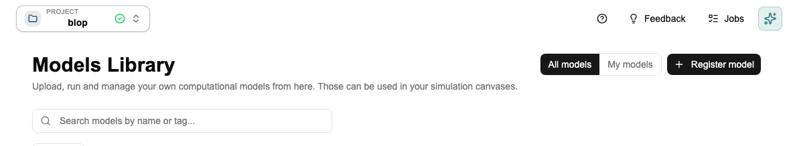

# Tutorial: Registering Your First Model

[← Home](Home) · [← Model Library](Model-Library)

> For source types, versioning rules, and best practices, see [Model Library](Model-Library).

This tutorial walks you through registering a Python script and verifying it works in a canvas. Takes about 10 minutes.

> **The Co-engineer can register models for you.** Upload your script in the Co-engineer chat and say *"Register this as a model."* It will infer the input/output schema automatically and handle the registration. This tutorial is for when you want to do it manually or understand what's happening under the hood.

---

## What you need

A Python script with a function named `run`, `main`, `execute`, `predict`, or `simulate` that takes inputs as arguments and returns a dict. A minimal example:

```python
def run(coating_thickness: float, porosity: float, temperature: float):
    result = coating_thickness * porosity * (1 + 0.002 * temperature)
    return {"adjusted_capacity": result}
```

---

## Step 1 — Register it

Click **Models Library** in the sidebar → **Register Model** → **Upload file**.



Upload your script. Protos reads it and infers the input/output schema automatically from your function signature. Review what it found — add units to every numeric field and a description to anything non-obvious. This documentation is what makes the model usable by your team later.

Fill in the name, description, and domain, then click **Save**.

---

## Step 2 — Test it in a canvas

Go to **Simulation Studio**, create a canvas, and add a **Model** block. Search for the model you just registered — the input fields appear as connection points.

Wire a Parameter block to each input, click **Start sequence**, and check the result. If it fails, the error message in the model block's detail panel will tell you what went wrong.

---

## Step 3 — Version it when the code changes

When you update the model: open it in the Model Library → **New Version** → upload the updated script → add a changelog note. Old canvases keep running on the previous version — their results stay reproducible. See [Model Library → Model Versioning](Model-Library#model-versioning).

---

## Registering from GitHub instead

If your model is in a public GitHub repo, use **Register Model → GitHub** instead of uploading a file. Protos clones the repo, detects the entry point, and generates a wrapper. The repo needs a `run`/`main`/`execute` function or a `protos.toml` file declaring the interface.

---

## Next step

→ [Tutorial: Building Your First Canvas](Tutorial-Simulation-Studio) — add your registered model as a block in a canvas and run it.

---

*[← Back to Home](Home)*
