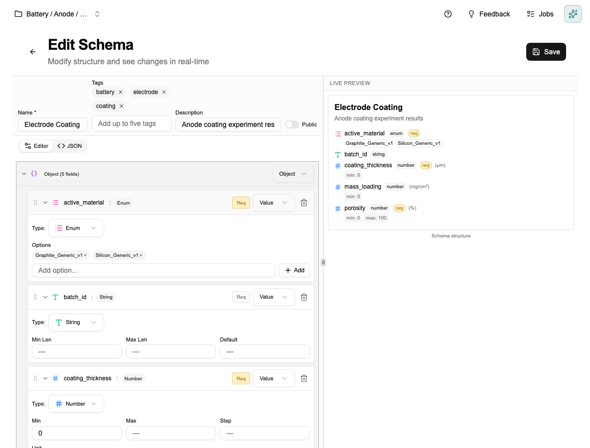

# Tutorial: Creating Your First Schema

[← Home](Home) · [← Schemas](Schemas)

> For a full reference on field types, naming conventions, and best practices, see [Schemas](Schemas).

This tutorial walks you through building a schema from scratch. Takes about 5 minutes.

---

## Step 1 — Open the Schema Editor

Click **Schemas** in the sidebar. You'll see any existing schemas as cards.

Click **+ New Schema** in the top right.

---

## Step 2 — Fill in the name and fields

The schema editor opens. Give it a name — use the domain + artifact convention: `Battery — Electrode Coating`, `Pharma — Tablet Formulation`.

Type the name and add fields one by one using the field editor. For each field you set a name, choose a type, and mark it required or optional.

**Choosing the right type:**
- `Number` — any measured value. Always set a unit (µm, %, mg/cm²).
- `Enum` — a fixed list of options. Use this instead of string whenever values come from a known set — it prevents typos and makes filtering work.
- `String` — free text for notes, IDs, anything open-ended.
- `Boolean` — yes/no.
- `Date` — when something happened.
- `Ref` — a link to another data document. See [Schemas → Using Reference Fields](Schemas#using-reference-fields).

---

## Step 3 — Save and review

Click **Save**. The schema appears in the library as a card showing its name, tags, and field count.

You can open it any time to see the full field structure, with the live preview on the right showing how documents following this schema will look.

---

## What to avoid

- Don't add fields you won't consistently fill in — empty fields break comparisons.
- Don't rename or remove fields once data documents exist against this schema — it can corrupt those documents.

---

*[← Back to Home](Home)*
