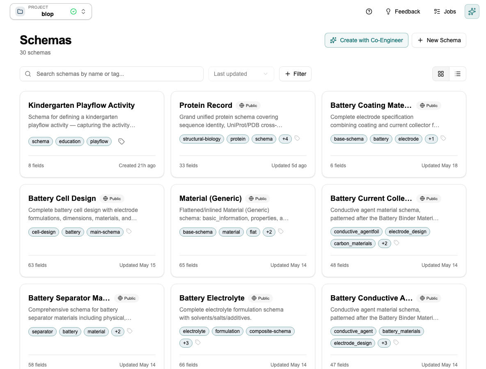
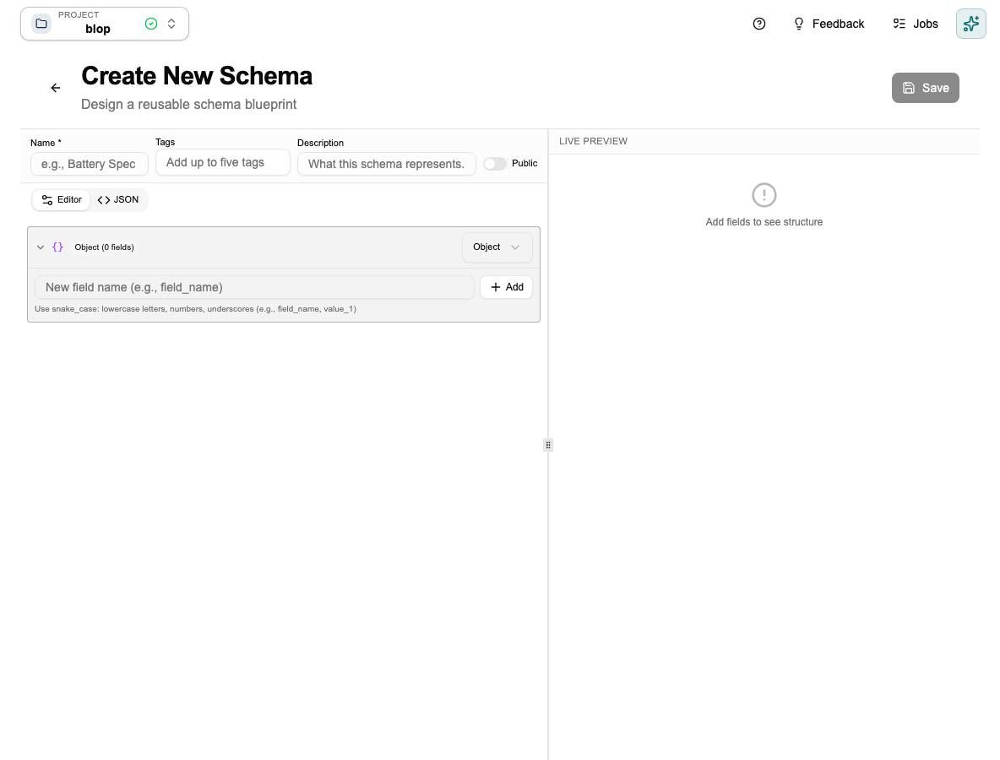
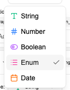
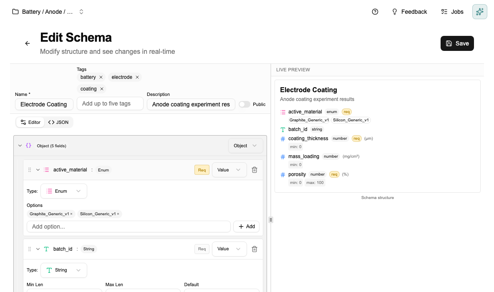
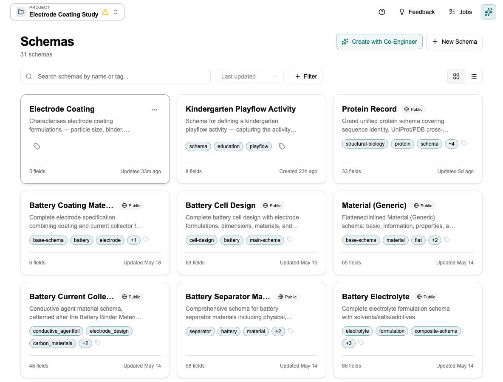

# Tutorial: Creating Your First Schema

[← Home](Home) · [← Schemas](Schemas)

This tutorial walks you through building a schema from scratch, explains the decisions you'll make along the way, and shows you what to watch out for. Takes about 5 minutes.

> **You can also ask the Co-engineer to do this for you.** Open the Co-engineer and say *"Create a schema for electrode coating experiments with fields for coating thickness, porosity, active material, and mass loading."* It will build the schema, choose the right types, and set the units — you just review and confirm. Skip to [Tutorial: Working with the Co-engineer](Tutorial-Co-engineer) if you'd rather start there.

---

## Step 1 — Open the Schema Editor

Click **Schemas** in the sidebar. You'll see any existing schemas as cards. Each card shows the schema name, tags, and how many fields it has.

Click **+ New Schema** in the top right.

---

## Step 2 — Give it a name

The schema editor opens. Name it using the domain + artifact convention: `Battery — Electrode Coating`, `Pharma — Tablet Formulation`, `Thermal — Operating Conditions`.

This naming makes schemas easy to find as your project grows — anyone can search by domain or type.

> **Keep it lean.** Only add fields that will actually be populated. A schema with 5 well-filled fields is far more useful than one with 20 fields that half the team leaves empty. Empty fields break comparisons and make documents harder to read.

---

## Step 3 — Add your fields

Type a field name in the bottom input and click **+ Add**. The field appears in the list and you set its type.

Click the **Type** dropdown on any field to change it:

For a full description of each type and when to use it, see [Schemas → Field Types](Schemas#field-types). The key decision in practice: use `Enum` instead of `String` whenever values come from a fixed set — it prevents typos and makes filtering reliable.

Mark a field **Required** only if the document is meaningless without it. A missing `coating_thickness` on an electrode coating record makes it useless for comparison. A missing `batch_notes` doesn't.

The **Live Preview** on the right updates as you add fields, showing exactly how documents following this schema will look:

---

## Step 4 — Save

Click **Save**. The schema appears in the library as a card.

The schema is now available across your project. Go to the [Data Studio](Data-Studio) to create your first data document from it.

---

## What to avoid

- **Don't add fields you won't fill consistently.** Sparse data breaks comparisons.
- **Don't rename or remove fields once data documents exist against this schema.** This can corrupt existing documents. Add a new schema version instead.
- **Standardise units before you create numeric fields.** Changing units later requires migrating all existing documents.

---

## Next step

→ [Tutorial: Using the Data Studio](Tutorial-Data-Studio) — create documents from this schema and compare them side by side.

---

*[← Back to Home](Home)*
