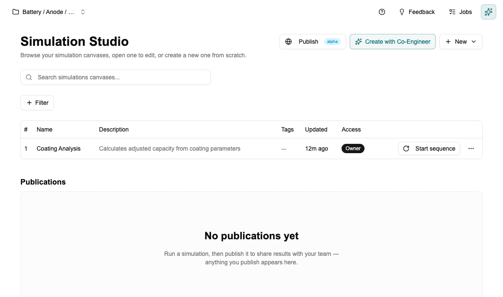
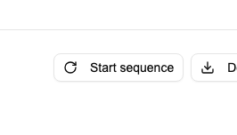
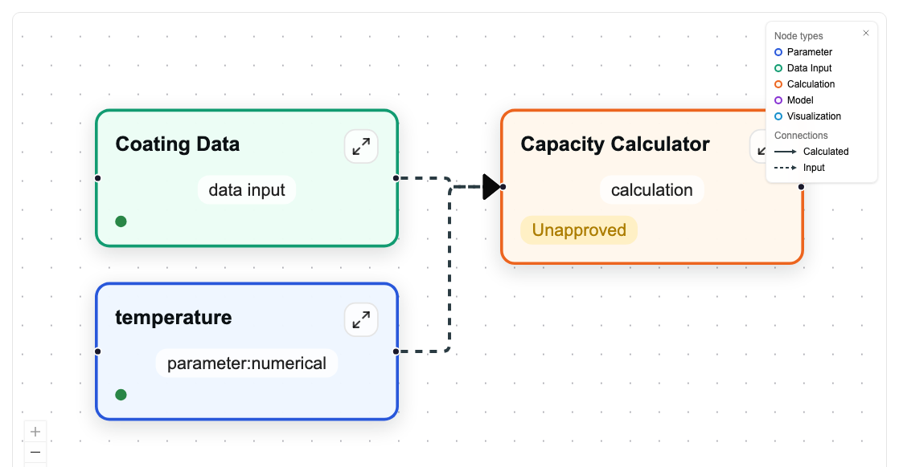

# Tutorial: Building Your First Canvas

[← Home](Home) · [← Simulation Studio](Simulation-Studio)

> For a full explanation of block types, sweeps, and how the canvas connects to the Data Studio, see [Simulation Studio](Simulation-Studio).

This tutorial walks you through building a canvas from an empty state. Takes about 10 minutes.

---

## What you need

At least one schema with one data document. If you don't have these yet, start with [Tutorial: Creating Your First Schema](Tutorial-Schemas).

---

## Step 1 — Open Simulation Studio

Click **Simulation Studio** in the sidebar. A new project starts with no canvases.

Click **+ New** → **New Canvas**. Give it a name and a short description of what it calculates.

---

## Step 2 — Add an Input block

Click **+ Add Component** → **Data Input**. Select your schema and the data documents you want to pull in. Choose which fields to expose — these become the values downstream blocks can use.

> You're not hardcoding values here — you're pointing at live documents from the Data Studio. Change the active documents there and the canvas picks up the new values automatically.

---

## Step 3 — Add a Parameter block

Click **+ Add Component** → **Parameter** → **Number**. Name it (e.g. `temperature`), set a value and unit.

A parameter is a value you control directly on the canvas — not from a document. You can change it any time and the canvas recalculates.

---

## Step 4 — Add a Calculation block and connect it

Click **+ Add Component** → **Calculation**. Write Python code that uses the upstream values. Then draw arrows connecting the Input and Parameter blocks to the Calculation block.

---

## Step 5 — Approve the calculation

Calculation blocks need your approval before they run. This is a safety check — you're confirming the code is safe to execute. Click **Approve** on the block.

After approval it runs automatically whenever its inputs change. If you edit the code, it goes back to needing approval.

---

## Step 6 — Run it

The canvas runs automatically when Data Studio inputs change. To force a full run from scratch, click **Start sequence**.

If any calculation blocks are unapproved, Protos will warn you and ask you to confirm before running them.

---

## What a finished canvas looks like

Here's a completed canvas with three connected blocks: a data input (green), a parameter (blue), and a calculation (orange). The arrows show the data flow.

Click any block to open its detail panel and see inputs, outputs, and execution status.

---

*[← Back to Home](Home)*
