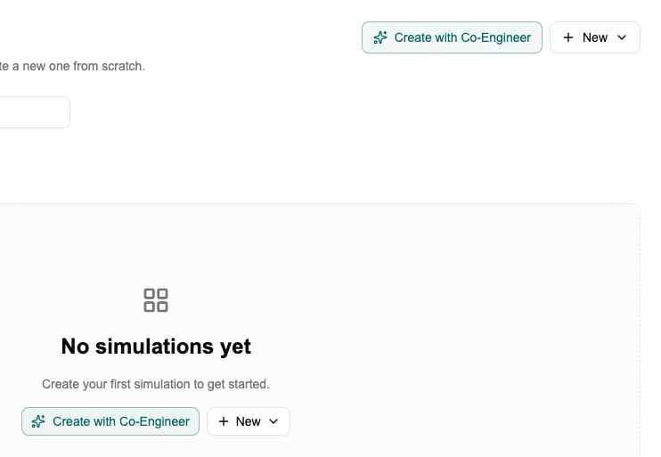

# Tutorial: Building Your First Canvas

[← Home](Home) · [← Simulation Studio](Simulation-Studio)

> For a full explanation of block types, sweeps, and how the canvas connects to the Data Studio, see [Simulation Studio](Simulation-Studio).

This tutorial walks you through building a canvas from scratch and running it. Takes about 10 minutes.

---

## What you need

A schema with at least one data document. If you don't have these yet, start with [Tutorial: Creating Your First Schema](Tutorial-Schemas).

---

## Step 1 — Create a canvas

Click **Simulation Studio** in the sidebar → **New Canvas**. Give it a name and open it.



---

## Step 2 — Add an Input block

Click **Add block** → **Input**. Select your schema and the data document you want to use. Choose which fields to expose as outputs — these become the values downstream blocks can use.

> You're not hardcoding values here — you're pointing at a live document. Change the active document in the Data Studio and the canvas picks it up automatically.

---

## Step 3 — Add a Parameter block

Click **Add block** → **Parameter** → **Number**. Give it a name (e.g. `temperature`), a value (e.g. `25`), and a unit (`°C`).

---

## Step 4 — Add a Calculation block and connect it

Click **Add block** → **Calculation**. Write Python code that uses the inputs from the blocks you'll connect. The variable names match the field names from the Input block and the parameter name you set:

```python
porosity = inputs["porosity"]
temperature = inputs["temperature"]

return {"adjusted_porosity": porosity * (1 + 0.002 * temperature)}
```

Draw arrows from the Input block and the Parameter block to the Calculation block.

---

## Step 5 — Approve the calculation

Calculation blocks need your approval before they run automatically — this is a safety check confirming the code is safe to execute.

Click **Approve** on the calculation block. After this it will run automatically whenever its inputs change.

> If you edit the code later, it goes back to needing approval.

---

## Step 6 — Run it

Change the parameter value — the calculation runs automatically.

Or click **Start sequence** to force a full run from scratch. If you have unapproved blocks, Protos will warn you and ask you to confirm before proceeding.

Click the Calculation block to see the results, execution status, and any errors.

---

## Step 7 — Try swapping the data

Go to the **Data Studio**, activate a different document from the same schema, and come back. The canvas re-runs automatically with the new values. This is how you test variants — swap data, compare results, without touching the canvas.

---

## Adding a sweep

To run across a range of values instead of one: add an **array parameter** block instead of a regular parameter, set min, max, and number of points, then run. You get a full output surface instead of a single result. See [Simulation Studio → Design Space Exploration](Simulation-Studio#design-space-exploration-sweep).

---

*[← Back to Home](Home)*
